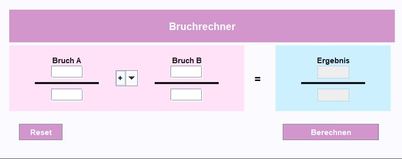

# Bruchrechner (Swing, IntelliJ GUI Designer)
Author: Sara Kutschi

LBS Eibiswald | 2aAPC

Ein Java-**Bruchrechner** mit klarer Darstellung (Zähler/Nenner).  
Layout: **Header (lila)**, **Eingabe (rosa)**, **Ergebnis (blau)**, darunter **Reset** links & **Berechnen** rechts.

  
---

## Features
- **Eingaben:** Bruch A & B (Zähler/Nenner, ganze Zahlen, Nenner ≠ 0)
- **Operatoren:** +, −, ×, ÷ (ComboBox)
- **Ergebnis:** Bruch (read-only)
- **Aktionen:** Berechnen (Default), Reset

---

## Interaktions-Design: Begründung zu **Nielsen (10 Heuristiken)**
1. **Status sichtbar:** Ergebnisbereich zeigt sofort Resultat/Fehler.
2. **Realwelt:** Brüche als Zähler/Nenner; Mathe-Symbole.
3. **Kontrolle:** Reset jederzeit; Operator frei wechselbar.
4. **Konsistenz:** Gleiche Struktur A/B/Ergebnis; Primäraktion rechts.
5. **Fehlerprävention:** Geteilte Felder, Nenner≠0-Check.
6. **Wiedererkennung:** Klare Labels A/B/Ergebnis, „=“ als Orientierung.
7. **Effizienz:** Enter = Berechnen; Tastatursteuerung.
8. **Minimalismus:** Nur Nötiges; Farben helfen Orientierung.
9. **Fehlerhilfe:** Kurze, klare Hinweise mit Lösung.
10. **Hilfe/Doku:** Tooltips („Ganze Zahl; Nenner ≠ 0“).

---

## Interface-Design: **Shneidermans 8 Goldene Regeln**
1. **Konsistenz:** Gleiches Raster, gleiche Abstände.
2. **Universal:** Große Ziele, guter Kontrast.
3. **Rückmeldung:** Ergebnis direkt neben den Eingaben.
4. **Abschluss:** Berechnen → sichtbares Resultat.
5. **Vermeidung:** Live-Checks; Button disabled bei Fehlern.
6. **Umkehrbarkeit:** Reset
7. **Kontrollgefühl:** User wählt Operator; nichts versteckt automatisch.
8. **Gedächtnislast runter:** Farbgruppen, „=“ als Brücke, identische Darstellung links/rechts.

